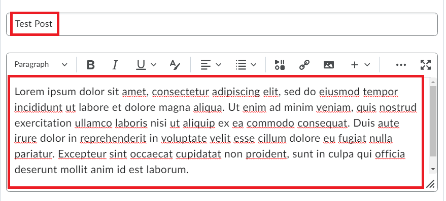
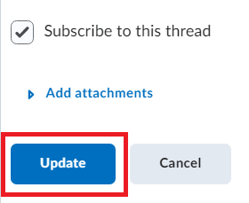
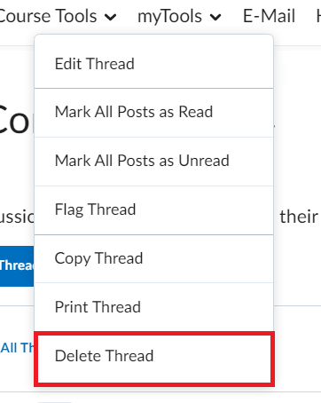

# Troubleshooting

## Overview

This section will troubleshoot common errors and problems users might encounter when completing the guided tasks. Some common problems are not fixable through the users student access to LearningHub. These issues will also be described below.

## Problems

### Removing a File From an Assignment

Starting from the submission screen where users can add files.

1. **Click** on the small x next to the file's name.
    {:style="display:block; margin-left:auto; margin-right:auto"}

!!! success
    The assignments name will be crossed out in the list of attached files.
    {:style="display:block; margin-left:auto; margin-right:auto"}

### Leave group button not visible

The instructor dictates the permissions available when interacting with the Groups Tab. If no “Leave Group” button is available in the “Action” column, users must contact their instructor to be manually removed from the group. 

!!! failure
    This task cannot be completed due to a user restriction.
    {:style="display:block; margin-left:auto; margin-right:auto"}

### How to Edit a Discussion Post

1. **Navigate** to the Discussion Board and **Find** the post to be edited.
    {:style="display:block; margin-left:auto; margin-right:auto"}
2. **Click** on the downward arrow menu.
    {:style="display:block; margin-left:auto; margin-right:auto"}
3. **Click** on “Edit Thread."
    {:style="display:block; margin-left:auto; margin-right:auto"}
4. **Edit** the post.
    {:style="display:block; margin-left:auto; margin-right:auto"}
5. **Click** on “Update.”
    {:style="display:block; margin-left:auto; margin-right:auto"}

!!! success
    A notification will appear at the bottom of the screen indicating that the post has been successfully updated.
    {:style="display:block; margin-left:auto; margin-right:auto"}

### “Start New Thread” Button Not Visible

If the “Start New Thread” button is not visible on a Discussion Board, that means the window to submit new Discussion Posts has closed. Some Discussion Boards have due dates which require students to make their posts before a specific deadline.

!!! failure
    At this point, there is no way to create a post on the board as the window for new posts has closed.
    {:style="display:block; margin-left:auto; margin-right:auto"}

### Resubmit an Assignment

Unless the assignment has a limitation on the number of submissions, assignments can be resubmitted multiple times following the same set of instructions as provided in the Submitting an Assignment section.  

### Delete a Discussion Post

1. **Navigate** to the Discussion Board and **Find** the post to be edited.
    {:style="display:block; margin-left:auto; margin-right:auto"}
2. **Click** on the downward arrow menu.
    {:style="display:block; margin-left:auto; margin-right:auto"}
3. **Click** on “Delete Thread.”
    {:style="display:block; margin-left:auto; margin-right:auto"}
4. **Click** on “Yes”
    {:style="display:block; margin-left:auto; margin-right:auto"}

!!! success
    A notification will appear at the bottom of the screen indicating that the post has been successfully deleted.
    {:style="display:block; margin-left:auto; margin-right:auto"}

## Conclusion

By the end of this section, user’s will be able to:  

:material-check-circle:{ .green-checkmark }   Resolve common issues that occur when completing the detailed tasks.

Bravo! Take a gander at the [glossary](../glossary) for definitions on terminology used throughout the user guide.